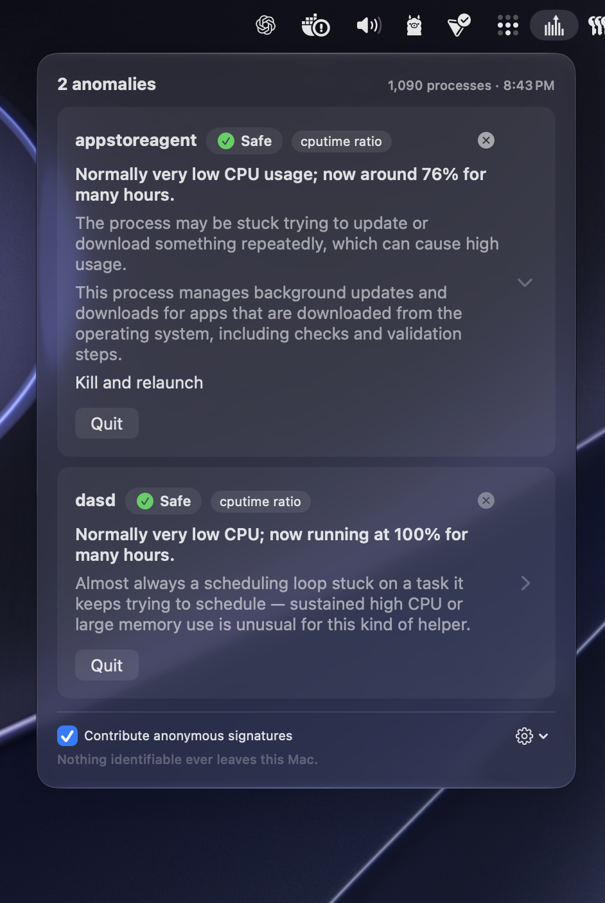

# Anomalous — macOS sensor

**[anomalous.bot](https://anomalous.bot)** · **[Download](https://anomalous.bot)** · **[Sponsor ♥](https://github.com/sponsors/msitarzewski)**

  

**Activity Monitor with a "So what?" and "Now what?" layer.**

<p align="center">
  
</p>

Every other Mac monitor is a **gauge**: iStat Menus, Stats, Activity Monitor —
they render CPU, memory, GPU, and network beautifully and stop. None of them
answer the three questions you actually have: **is this normal? · what is it? ·
what do I do?** Anomalous is the **judge**. A quiet menu-bar app that watches
your Mac across every measurable dimension, stays silent when nothing is wrong,
and — only when something genuinely is — surfaces a plain-language diagnosis
card with a safe action to take.

This repository is the **macOS sensor** — the on-device client. It's open source
on purpose (see *Why this is open*). The recon/triage backend and the aggregate
signal network are **separate services, not part of this repo**; the sensor is
useful entirely on its own, offline, with no account.

---

## What it does

- **Measures** far more than CPU and RAM. Per process, every tick: sustained &
  cumulative **CPU**, **physical-footprint memory** (the honest number Activity
  Monitor shows, not RSS) & compressed memory, **disk I/O**, **energy** (in
  nanojoules, split P-core vs E-core), **wakeups** (the real battery-drain
  signal), **per-process GPU** utilization & memory, **per-process network**
  throughput, and **Neural-Engine** memory — plus system context (memory
  pressure, swap, thermal state, load). Most of it is read from calls the OS was
  already making. Including the per-process baseline math and detection, the
  full sweep measures **~0.4% CPU on a busy Mac** — and **0% between checks**
  (the work is a short burst every 60–90s, not a continuous poll).
- **Detects** with statistically honest, per-process baselines — robust
  **median/MAD** (a plain average hides the very spike you're hunting), **seasonal**
  hour-of-day / weekday baselines (*a nightly backup is not an anomaly*), and
  **cross-dimension correlation** so "burning energy **and** hammering the GPU
  **and** spawning children" becomes **one** insight, not five notifications. A
  warm-up gate means it never cries wolf about a process it's watched for two
  minutes, and every alert carries a **confidence** score — only high-confidence
  findings ever reach you.
- **Explains** on-device with Apple's **Foundation Models**, grounded by a
  reviewed knowledge corpus of macOS processes. The detector decides *what's
  wrong* and hands the model the exact numbers; the model only puts it in plain
  words — it **quotes** the facts, never invents them. Typed card: *what it is ·
  why it's probably hot · is this normal · what to do*.
- **Escalates** in three tiers, cheapest first (see *On-device intelligence*):
  on-device → Apple **Private Cloud Compute** → the paid Anomalous backend. You
  only ever *pay* on an explicit tap.
- **Acts**, conservatively, with safety tiers: Quit / Force Quit user processes,
  `brew services` stop/restart, root-daemon termination via the helper, or an
  explain-only card for things you must not kill.
- **Learns your normal.** One tap — **"Normal for me"** — *raises the envelope*
  for that process instead of muting it. Snooze for an hour or a day. And the
  anti-mute guarantee: if something you acknowledged comes back **materially
  worse**, or misbehaves in a **new** way, you hear about it. "Expected" means
  *"this much, this way, is fine"* — never *"be silent forever."*
- **Sees root daemons** (dasd, WindowServer, kernel_task…) — where the worst
  runaways hide — via an optional privileged helper, installed with one System
  Settings approval, never a password prompt.
- **Stays out of your way.** Silence is the default and the brand.

## Living quietly in the OS

Anomalous is built to be a first-class macOS 26/27 citizen that you forget is
running until the one moment it matters:

- **Ambient desktop widget** — a calm "all systems nominal" glyph (matching the
  menu-bar popover) that *comes to life* only on a confirmed anomaly, with
  **Snooze** / **Normal for me** right in the tile. No live gauges ticking; it
  earns your attention only when it has something true to say.
- **Ask Siri / Spotlight** — *"Is my Mac behaving normally?"* Built on App
  Intents, so the same actions appear in Shortcuts, Spotlight, and a Control
  Center toggle.
- **Notifications with discipline** — passive by default; a confirmed,
  high-confidence anomaly posts **Time Sensitive** to break through Focus, with
  Investigate / Snooze / Normal-for-me inline. A burst collapses into one
  grouped alert. It will not nag you.
- **Energy-aware** — the base cadence adapts to power (≈60s plugged in, ≈90s on
  battery) and backs off further (×3 interval, lighter probes) under thermal
  pressure or Low Power Mode, so the thing watching your battery never becomes
  the thing draining it.
- **Radically transparent** — a *"what we sample & why"* panel in plain language,
  a visible local-processing badge, and an **auditable no-egress** posture you
  can verify in this source, not just take on faith.

## Why this is open

The sensor is open source because **trust is the product**. Anyone can read
exactly what's collected and what's transmitted; the send log in the app is
diffable against this source. Nothing identifiable ever leaves the machine, and
you don't have to take our word for it — you can read the code that composes
every payload.

The value of the wider product lives *upstream* — curated diagnosis, the
aggregate observatory, the reviewed process-identity corpus — so the client is
free, inspectable, and embeddable. Partners are welcome to build on it under
Apache-2.0.

## On-device intelligence — a three-tier escalation

The local LLM is the **explainer**, never the detector. A small on-device model
that can hallucinate a process's identity must never be the thing that *decides*
something is wrong — so the classical detector always decides, and the model
only phrases the verdict over facts it's handed.

| Tier | Runs on | For | Cost & privacy |
|---|---|---|---|
| **1 · On-device** | Apple **Foundation Models** on your Mac | Every card. Tool-calling over live process facts, grounded by the corpus. | Free · offline · nothing leaves the machine |
| **2 · Private Cloud Compute** | Apple's **PCC** | Hard / novel anomalies the on-device model can't ground confidently. Routed automatically. | Free · key-less, no account · Apple's verifiable no-storage privacy |
| **3 · Get Help** | The Anomalous backend | Only on an **explicit tap**. Frontier-AI triage with cited web evidence, and a shared diagnosis cache that gets cheaper & better for everyone over time. | Prepaid · every payload allowlisted and **logged locally byte-for-byte** |

**Grounding.** Cards are grounded by a reviewed, community-correctable
**process-identity corpus** — shipped with the app, and refreshed from a signed
feed the client **verifies locally** (Ed25519) before trusting. Ownership and
install source are read **live per process** (Homebrew vs a native root daemon
vs Docker), never assumed. Where Apple Intelligence is unavailable, cards
degrade cleanly to knowledge-corpus-only answers.

## Architecture

```
Collector (bursty every 60–90s)           System signals
  libproc · rusage_v6 · IOKit/AGX GPU       pressure · swap · thermal · load
  · NetworkStatistics · IOHID/IOReport
        │                                          │
        ▼                                          ▼
Detection  ── robust MAD + seasonal baselines · Δ-rate rules · correlation ──►  Confidence
        │                                                                          │
Privileged helper (root) ─ fills root-owned gaps (XPC, Team-ID-pinned) ───────────┤
        │                                                                          ▼
        │                                        Judgment  (Foundation Models, tool-calling, GROUNDED)
        │                                          │   └─ corpus (signed feed, verified locally)
        │                                          ▼
        │                                        Diagnosis card  ──►  Action layer (safety tiers)
        │                                          │                    · widget · Siri · notifications
        │                                          ▼
        └────────────────────────►  Escalation:  on-device → PCC → backend (explicit tap)
                                       allowlisted payload + local send log
```

- `AnomalousCore/` — the portable engine: collector, detection & judgment core,
  the on-device AI tiers, corpus feed client, escalation/ingest, the helper XPC
  protocol. The wire protocol lives in [`protocol/`](protocol/).
- `App/` — the SwiftUI menu-bar app (`MenuBarExtra`, `LSUIElement`), Settings,
  history, App Intents, notifications, the acknowledgment store, and the
  privileged-helper client.
- `Widget/` — the ambient WidgetKit extension + Control Center controls.
- `AnomalousCore/Sources/AnomalousHelper/` — the root helper (an
  `SMAppService.daemon`; samples and terminates root-owned processes only).

## Requirements

- **macOS 26 (Tahoe) or later, Apple Silicon.** macOS 27 (Golden Gate)
  recommended — the richer on-device models and per-process signals are best there.
- Xcode 26+ (27 for the macOS-27 features) and
  [XcodeGen](https://github.com/yonaskolb/XcodeGen) (`brew install xcodegen`).
- **Apple Intelligence** for the on-device judgment layer; degrades to
  knowledge-corpus-only cards where unavailable.
- Private Cloud Compute (tier 2) needs the app to carry Apple's PCC entitlement;
  without it, escalation simply stays on-device or waits for an explicit tap.

## Building from source

Developer setup, the build/sign/notarize pipeline, entitlements &
provisioning-profile notes, and backend configuration are in
**[BUILD.md](BUILD.md)** — end users don't need any of it, just the
[download](https://anomalous.bot).

## Support

Anomalous is free and open source. If it saves you a debugging session, consider
**[sponsoring on GitHub](https://github.com/sponsors/msitarzewski)** — sponsorship
funds the curation (the process-identity corpus, the reviewed known-issues feed)
that makes the free tier better for everyone.

More native macOS tools from the same workshop — small, fast, open, no telemetry:
**[Brew Browser](https://brew-browser.zerologic.com)** (a GUI for Homebrew) ·
**[Agency Agents](https://agencyagents.app)** (a control surface for AI agent personas).

## Network disclosure

Anomalous is quiet on the network — no third parties, no analytics, no telemetry.
Every host it contacts, and when, is listed in **[NETWORK.md](NETWORK.md)**.

## Security

Anomalous runs a root helper that can stop processes and composes payloads that
leave the machine — so security reports matter. See **[SECURITY.md](SECURITY.md)**
for scope and coordinated disclosure, and report privately to
**msitarzewski@gmail.com** — not a public issue.

## License

[Apache License 2.0](LICENSE) — © 2026 Michael Sitarzewski.

*"Anomalous" and the Anomalous mark are trademarks; the license grants no trademark
rights (see LICENSE §6). Fork the code freely; ship your fork under its own name.*
